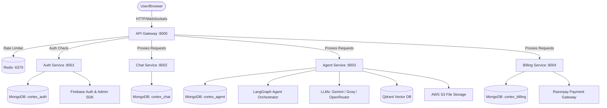

# Cortex AI — Multi-Agent AI Orchestration Platform

Cortex AI is a state-of-the-art, microservice-based AI platform that coordinates specialized AI agents (using LangGraph and LangChain) to solve complex workflows. Users can chat with general assistants, run programming scripts, generate PDFs or PowerPoint presentations, execute semantic search queries over documents (RAG), use computer vision, and generate images.

---

## 🏗️ Architecture Overview

Cortex AI is structured as a collection of decoupled microservices managed by an API Gateway:



### Repository Structure
```filepath
cortex-ai/
├── package.json                   # Workspace root package.json for script orchestration
├── frontend/                      # React SPA with Vite, Redux, Tailwind CSS v4, and Monaco Editor
│   ├── .env.example
│   ├── firebase.js                # Firebase client-side config
│   └── src/
└── backend/                       # Backend microservices and utilities
    ├── docker-compose.yml         # Dev services setup (Redis)
    ├── package.json
    ├── gateway/                   # API Gateway (Express Proxy, Redis rate limiting)
    │   └── .env.example
    ├── shared/                    # Code shared between services (e.g. Redis client connection)
    └── services/
        ├── agent/                 # LangGraph agent orchestration service
        │   ├── .env.example
        │   ├── agents/            # Specialized agents (chat, coding, search, pdf, ppt, etc.)
        │   └── graph/             # Supervisor state graph setup
        ├── auth/                  # Authentication service (Firebase Admin API, MongoDB)
        │   ├── .env.example
        │   └── serviceAccount.json # Firebase Admin credentials
        ├── billing/               # Billing and payment integration (Razorpay, MongoDB)
        │   └── .env.example
        └── chat/                  # Chat state persistence service (MongoDB)
            └── .env.example
```

---

## 🛠️ Tech Stack & Specialized Agents

*   **Frontend**: React (v19), Vite, Tailwind CSS (v4), Redux Toolkit, Framer Motion, Monaco Editor (`@monaco-editor/react`), Lucide React.
*   **Backend Microservices**: Node.js (ESM), Express.js (v5), ioredis, mongoose, multer, pdfkit, pptxgenjs, pdf-parse.
*   **AI Framework & Orchestration**: LangGraph, LangChain Core, Tavily Search, Qdrant Vector Database.
*   **Authentication**: Firebase Authentication (Client-side) & Firebase Admin SDK (Server-side verification).
*   **Payments**: Razorpay Node SDK.
*   **Storage**: AWS S3 Node SDK (for file uploads and PDF/PPT artifacts).

### LangGraph Agent Graph
Cortex AI routes user prompt requests dynamically via a **Supervisor Router Node** to these specialized agent nodes:
1.  **`chat`**: Standard chat assistant (powered by Llama 3.3 70B via Groq).
2.  **`coding`**: Code analysis and script generator (powered by DeepSeek-Chat via OpenRouter).
3.  **`search`**: Online search capability (using Tavily API to fetch real-time search context).
4.  **`pdf`**: Dynamic PDF document generator (using `pdfkit`).
5.  **`ppt`**: Dynamic PowerPoint slideshow generator (using `pptxgenjs`).
6.  **`image`**: Generates and edits images.
7.  **`vision`**: Image description and visual understanding (powered by Gemini 2.5 Flash).
8.  **`pdf_rag`**: Document search & question answering (using Qdrant and text splitters).

---

## 📋 Prerequisites

Before starting local development, make sure you have the following:
*   [Node.js](https://nodejs.org/) (v18.x or above)
*   [Docker Desktop](https://www.docker.com/products/docker-desktop/) (for Redis container)
*   [MongoDB Instance](https://www.mongodb.com/) running locally or via Atlas
*   Accounts & API Keys for:
    *   [Firebase](https://firebase.google.com/) (Web Project & Admin SDK Private Key)
    *   [Groq API](https://console.groq.com/)
    *   [Google AI Studio (Gemini)](https://aistudio.google.com/)
    *   [OpenRouter](https://openrouter.ai/)
    *   [Tavily Search](https://tavily.com/)
    *   [Qdrant](https://qdrant.tech/) (Cloud or local database instance)
    *   [AWS S3](https://aws.amazon.com/s3/) (Bucket & Access Credentials)
    *   [Razorpay](https://razorpay.com/) (API Key ID & Secret)

---

## 🚀 Getting Started

### Step 1: Install Dependencies
From the root workspace directory, run:
```bash
npm run install:all
```
This script installs parent dependencies, `concurrently` (for running services), and automatically triggers `npm install` inside all subprojects (`frontend`, `gateway`, `agent`, `auth`, `billing`, and `chat`).

### Step 2: Set Up Environment Files
Copy the environment template files in each service directory and populate them with your secrets:

```bash
# Frontend
cp frontend/.env.example frontend/.env

# Gateway
cp backend/gateway/.env.example backend/gateway/.env

# Services
cp backend/services/auth/.env.example backend/services/auth/.env
cp backend/services/chat/.env.example backend/services/chat/.env
cp backend/services/agent/.env.example backend/services/agent/.env
cp backend/services/billing/.env.example backend/services/billing/.env
```

### Step 3: Firebase Admin Setup
1.  Go to your **Firebase Console** -> **Project Settings** -> **Service Accounts**.
2.  Click **Generate New Private Key**.
3.  Download the JSON file, rename it to `serviceAccount.json`, and place it in the `backend/services/auth/` directory:
    ```bash
    # Path to place the credentials:
    backend/services/auth/serviceAccount.json
    ```

### Step 4: Start Databases & Cache
Use Docker Compose to spin up Redis:
```bash
npm run redis:up
```

### Step 5: Start the Development Server
Launch the entire frontend and all microservices concurrently with one command:
```bash
npm run dev:all
```
Once initialized, the services will be running on:
*   **Frontend SPA**: http://localhost:5173
*   **API Gateway**: http://localhost:8000
*   **Auth Service**: http://localhost:8001
*   **Chat Service**: http://localhost:8002
*   **Agent Service**: http://localhost:8003
*   **Billing Service**: http://localhost:8004

To shut down Redis when finished:
```bash
npm run redis:down
```

---

## 🔧 Environment Variables Guidance

### Frontend Config (`frontend/.env`)
| Variable | Description | Example / Required |
| :--- | :--- | :--- |
| `VITE_FIREBASE_API_KEY` | Client-side Firebase project API key. | `AIzaSyA1...` |
| `VITE_SERVER_URL` | Base API Gateway endpoint address. | `http://localhost:8000` |
| `VITE_RAZORPAY_KEY` | Razorpay Key ID used to initialize Checkout. | `rzp_test_...` |

### API Gateway Config (`backend/gateway/.env`)
| Variable | Description | Example / Required |
| :--- | :--- | :--- |
| `PORT` | API Gateway entry port. | `8000` |
| `REDIS_URL` | Redis instance connection URL. | `redis://localhost:6379` |
| `AUTH_SERVICE` | Auth microservice local URL. | `http://localhost:8001` |
| `CHAT_SERVICE` | Chat microservice local URL. | `http://localhost:8002` |
| `AGENT_SERVICE` | Agent microservice local URL. | `http://localhost:8003` |
| `BILLING_SERVICE`| Billing microservice local URL. | `http://localhost:8004` |

### Agent Service Config (`backend/services/agent/.env`)
| Variable | Description | Example / Required |
| :--- | :--- | :--- |
| `PORT` | Running port for the Agent Service. | `8003` |
| `MONGODB_URL` | MongoDB database connection URI. | `mongodb://localhost:27017/cortex_agent` |
| `GOOGLE_API_KEY` | Gemini API Key for vision models. | `AIzaSy...` |
| `GROQ_API_KEY` | Groq API Key for Llama 3.3. | `gsk_...` |
| `OPENROUTER_API_KEY`| API Key for DeepSeek-Chat. | `sk-or-v1-...` |
| `TAVILY_API_KEY` | Web Search tool key. | `tvly-...` |
| `QDRANT_URL` | Qdrant vector database URL. | `https://...` or `http://localhost:6333` |
| `QDRANT_API_KEY` | Qdrant Database API credentials. | `your_key` |
| `AWS_ACCESS_KEY_ID` | AWS developer credentials for S3. | `AKIA...` |
| `AWS_SECRET_ACCESS_KEY`| AWS secret access key. | `your_secret` |
| `AWS_REGION` | AWS S3 Bucket hosting region. | `ap-south-1` |
| `AWS_BUCKET_NAME` | S3 bucket name. | `cortex-ai-artifacts` |
| `GATEWAY_URL` | Gateway URL. | `http://localhost:8000` |
| `AUTH_SERVICE` | Auth microservice address. | `http://localhost:8001` |
| `CHAT_SERVICE` | Chat microservice address. | `http://localhost:8002` |

### Auth Service Config (`backend/services/auth/.env`)
| Variable | Description | Example / Required |
| :--- | :--- | :--- |
| `PORT` | Running port for the Auth Service. | `8001` |
| `MONGODB_URL` | MongoDB database connection URI. | `mongodb://localhost:27017/cortex_auth` |
| `FRONTEND_URL` | Client URL allowed for CORS. | `http://localhost:5173` |

### Billing Service Config (`backend/services/billing/.env`)
| Variable | Description | Example / Required |
| :--- | :--- | :--- |
| `PORT` | Running port for the Billing Service. | `8004` |
| `MONGODB_URL` | MongoDB database connection URI. | `mongodb://localhost:27017/cortex_billing` |
| `AUTH_SERVICE` | Auth microservice address. | `http://localhost:8001` |
| `RAZORPAY_KEY_ID` | Razorpay Developer Key ID. | `rzp_test_...` |
| `RAZORPAY_KEY_SECRET`| Razorpay Private Secret Key. | `your_razorpay_secret` |

### Chat Service Config (`backend/services/chat/.env`)
| Variable | Description | Example / Required |
| :--- | :--- | :--- |
| `PORT` | Running port for the Chat Service. | `8002` |
| `MONGODB_URL` | MongoDB database connection URI. | `mongodb://localhost:27017/cortex_chat` |

---

## 🤝 Contribution Guidelines

We welcome contributions! Please adhere to the following steps to ensure smooth collaboration:

### 1. Code Standards
*   Keep files written as **ES Modules (`import/export`)**.
*   Do not hardcode API credentials. Always use `process.env` in the backend and `import.meta.env` in Vite.
*   Document helper functions and include comments explaining complex logic, especially within LangGraph agents.

### 2. How to Add a New AI Agent to the Orchestrator
To extend the orchestrator with a new agent (e.g. `translation`):
1.  **Create the Agent Logic**:
    Create a new file in `backend/services/agent/agents/translation.agent.js`:
    ```javascript
    export const translationAgent = async (state) => {
        // 1. Perform rate limiting & credit deductions
        // 2. Load model from utils/model.js
        // 3. Process instructions
        // 4. Return updated state
    };
    ```
2.  **Define Model Binding**:
    Add any new model instances to `backend/services/agent/utils/model.js` in the `getModel` switch.
3.  **Update Graph Annotation State**:
    If your agent needs custom context fields, append them to `AgentState` in `backend/services/agent/graph/state.js`.
4.  **Register the Node**:
    Import and add the agent node in `backend/services/agent/graph/supervisor.graph.js`:
    ```javascript
    import { translationAgent } from "../agents/translation.agent.js";
    // ...
    workflow.addNode("translation", translationAgent);
    ```
5.  **Configure Routing**:
    In the router conditional switch block inside `supervisor.graph.js`, add the transition logic routing to `"translation"`, and wire up the edge:
    ```javascript
    workflow.addEdge("translation", "__end__");
    ```

### 3. Git Workflow
1.  Fork the repository and create your branch from `main`:
    ```bash
    git checkout -b feature/amazing-feature
    ```
2.  Test your changes locally.
3.  Commit your changes following standard messages:
    ```bash
    git commit -m "feat: add translation agent to supervisor"
    ```
4.  Push your changes and open a Pull Request.

---

## 📄 License
This project is licensed under the ISC License.

